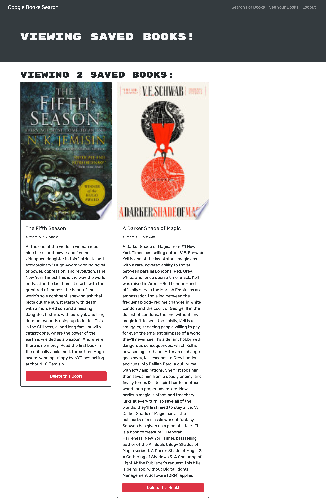

## Booksearch

This application, a full stack web application, was developed by Joseph Cosgrove with starter code from the University of Pennsylvania's Full Stack Coding Bootcamp. The application allows a user to sign in using JWT (JSON Web Tokens) and curate a profile of books from a database managed using mongoDB Atlas. This application also features the GraphQL library and uses queries and mutations in place of RESTful API calls. 

Front End:

- HTML
- CSS
- React (JSX)
- JavaScript
- Express

Back End:

- Mongoose 
- Apollo
- GraphQL
- B-Crypt

Deployment:

- MongoDB Atlas
- IndexedDB
- Git and Github
- Heroku

The application also features offline functionality.

The deployed application can be located at: https://lps-booksearch.herokuapp.com/

Joseph can be contacted with questions at jcosgrovecoding@gmail.com